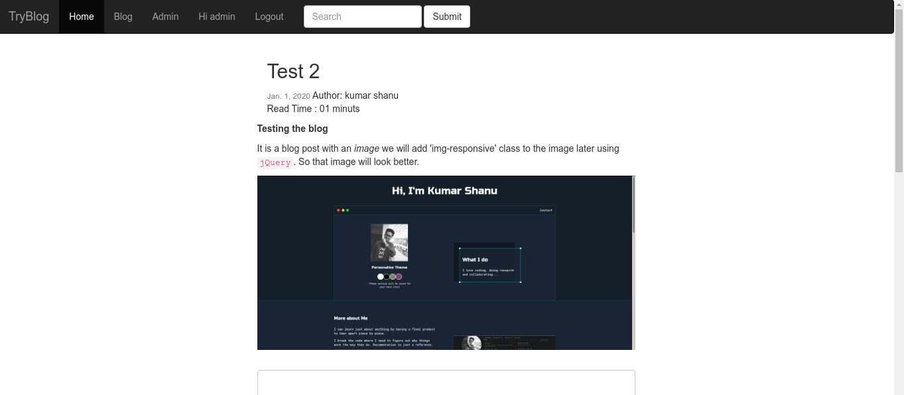

# DjangoBlogApp

A blog webapplication in `django` with the functionality of -
- Draft post
- Read Time
- Slug
- Coments and Replies
- Image Upload
- Markdown TextEditor Support
- User Accounts
- CRUD Operations
- Search operation


## Screenshot


## Getting Started

### Requirements

Python 3.7 & up\
Virtual Environment (pipenv or virtualenv)


### 1. Create Virtual Environment & Install Django

```bash
$ cd /path/to/dev/folder
$ mkdir try_django
$ cd try_django
$ pipenv --python 3.7 install django==2.2.13

OR

$ pipenv shell
$ pipenv sync
```

### 2. Run Server

```bash

$ cd ./tryBlog
$ python manage.py runserver
```


#### [Kumar Shanu](https://github.com/its-kumar/)
